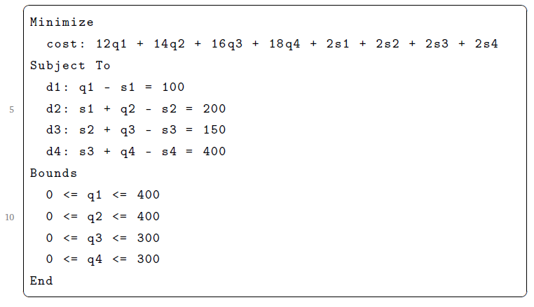
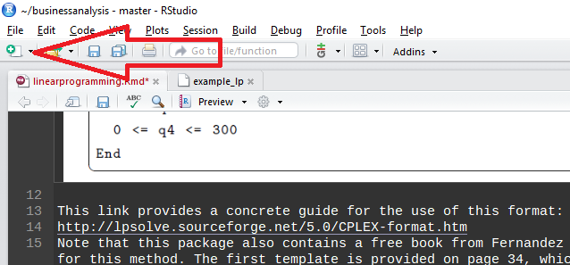
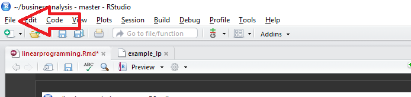

This notebook will give you an intro to Linear Programming in R. Our aim here is to let you write down the functions and constraints in the same form as inthe exam. Enjoy :)
<p></p><p></p>
<h3> CPLEX </h3>
In order to "just write down" the functions, we need to work with a particular format which is the "CPLEX". Its based on a more complicated engine that is used by big companies like IBM. R, of course, also provides a free alternative. The overal format is as follows.



This link provides a concrete guide for the use of this format:
http://lpsolve.sourceforge.net/5.0/CPLEX-format.htm
Note that this package also contains a free book from Fernandez that provide excellent examples for this method. The first template is provided on page 34, which is excerpted above.

<h4> Workflow CPLEX </h4>

The CPLEX format is based on ASCII file encoding. The workflow of creating a CPLEX file is a follows. You can create a new CPLEX file in RStudio is: click on the new file button. This will open a menu, select txt file. 


When everything has been entered in the correct CPLEX format, you can save the file by going on the menubar and clicking on the file button. 


From there you select the "Save file with encoding..." option. This will open another small screen with a few options of encoding, including ASCII. Select ASCII. After that you can select a path name for the file. Please note that if you save it as linear.programm.txt, you need to refer to it as such. In the examples above we used no extension (.txt, .doc, .docx, etc..) and therefore do not refer to one either in our commands.


<h3> Required Packages </h3>
There are 3 packages required to run these linear programms

<ul>
<li>glpkAPI</li>
<li>Rglpk</il>
</ul>

So lets install those by executing the code below:
```{r}
install.packages("glpkAPI")
install.packages("Rglpk")
```

Having installed the requried packages, we can run the generic code for linear programming which is:
```{r}
library(glpkAPI)
library(Rglpk)
#first, create an object which is a GLPK problem
problem <- initProbGLPK(ptrtype = "glpk_prob")
#this function reads a file and puts it into the object we created

readLPGLPK(problem, "example_lp")
#just solves the problem

solveSimplexGLPK(problem)
#prints ranges from a problem object into a file

printRangesGLPK(problem, fname = "report.txt")
#shows the file

file.show("report.txt")

```

In order to undestand the code above, I want to elaborate on what an API is. An API is an "Application Programming Interface". More simply put, its a way of communicating to other software. In order to use GLPK (GNU Linear Programming Kit), we need to create an object within this package. To do this we use the initProbGLPK, which initiates an empty object within the GLPK package. Note that this object is connected to R through an object in R, called "problem". More simply put: the "problem" object in R is the connection to the "glpk_prob" object in GLPK. These objects are in effect mirrors and connections. The read, solve and print commands dont require an object within R, since they are executed in the GLPK package.  Due to the fact that the real calculations are not run in R, the sensitivty report cannot be displayed in the terminal either. For this reason a file.show command has been used, to open the file when the calculations are done. 

<h3> Examples </h3>

There are examples of how to write Linear Programs in CPLEX in the book that is also added to this zip file. The book is called "Linear Programming.pdf".


<h4>Integer linear program: Two models of chairs.</h4>

The problem is described on p.57 of the book.
We have two models, in the first  we use integer variables, in the second binary integer variables.
We created furnituretypes_first and furnituretypes_second, check out the models within!


However, for an integer linear program our previous workflow doesn't work - it ignores the integers! So here is a crash course in writing functions :P

```{r Chairs example}

#first, create a function. 
SolverLP<-function(model,method="CPLEX_LP",decimal=0)
{
  #within the function, activate Rglpk package
  library(Rglpk)
  #similar to what we used before, but specify rows like constraints etc.
  model1.lp<-Rglpk_read_file(model,type=method,
                             verbose=F)
  model1.lp.sol<-Rglpk_solve_LP(model1.lp$objective,
                                model1.lp$constraints[[1]],
                                model1.lp$constraints[[2]],
                                model1.lp$constraints[[3]],
                                model1.lp$bounds,
                                model1.lp$types,
                                model1.lp$maximum)
  #load another package for making tables from a list
  library(xtable)
  #make a bunch of objects with the outputs of the model. The outputs are called in the same way as columns of a DF.
  model1.lp.sol.df<-as.data.frame(model1.lp.sol$solution)
  model1.lp.sol.df<-rbind(model1.lp.sol.df,c(model1.lp.sol$optimum))
  #name the rows/cols
  rownames(model1.lp.sol.df)<-c(attr(model1.lp,"objective_vars_names"),"obj")
  colnames(model1.lp.sol.df)<-"Solution"
  #make a new table object
  table.sol<-xtable(model1.lp.sol.df,digits=decimal)
  results<-list(sol=model1.lp.sol,df=model1.lp.sol.df)
  return(results)
  #make a file with the results and show it
  printRangesGLPK(model1.lp.sol, fname = "report.txt")
  file.show("report.txt")
}

```


if you run the code snip about, you'll get a new function in the environment to the right.

now to make an LP (using chairs example from the LP book)
```{r}
chairsprob1<-SolverLP("furnituretypes_first")
SolverLP("furnituretypes_first")


#and the second one.
chairsprob2<-SolverLP("furnituretypes_second")
chairsprob2

#how to read this?
#the leftmost output is the R console, disregard it for now. The two dataframes show the first and the second solutions, respectively. THe second one has a higher optimum, in accordance with new constraints.
#unfortunately, it is not possible to get the sensitivity report with this method, because the object is not associated with GLPK API anymore.


```

Another thing you'll be learning in the next weeks are problems where there are several goals. The first type are goal optimization problems. Say I want to build 3 houses and spend 100 dollars, I can deviate from one or both this goals to an extent. This can be modeled:

```{r}
#first, create an object which is a GLPK problem
golp <- initProbGLPK(ptrtype = "glpk_prob")
#this function reads a file and puts it into the object we created

readLPGLPK(golp, "GOLP")
#just solves the problem

solveSimplexGLPK(golp)
#prints ranges from a problem object into a file

printRangesGLPK(golp, fname = "golpa.txt")
#shows the file

file.show("golpa.txt")

#again the integers are ignored!

```

